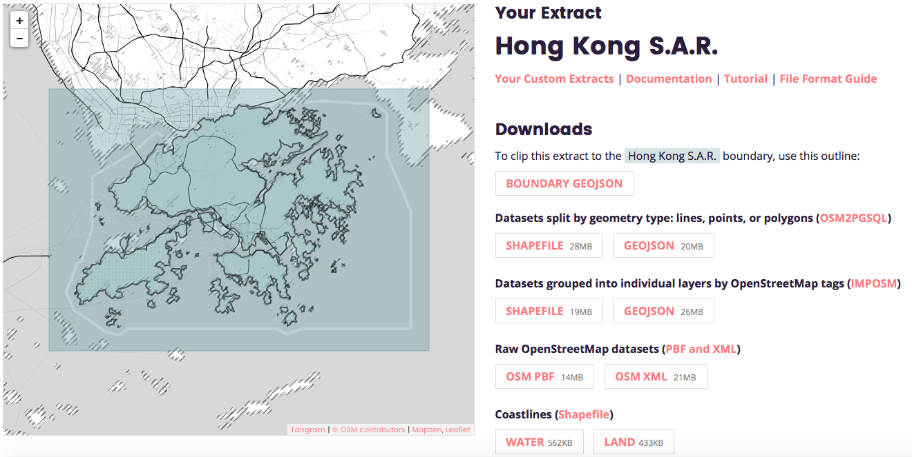

# Using OSM Data to Create a SpatialPolygon of Hong Kong
1.  Extract OSM data from [Mapzen](https://mapzen.com/data/metro-extracts)

2.  We need `Coastlines(land)` in `Shapefile` format and `OSM2PGSQL` in `geojson` format 

3.  Define `lands` to be the directory containing the `Shapefile` of `Coastlines(land)` and `lands_layer` to be the layer name of `Shapefile`

4.  Need library `rgdal` and `sp`, then load the `Coastlines(land)` as follows:
```
require(rgdal)
require(sp)
lands<-readOGR(dsn=lands,layer=lands_layer)
lands<-spTransform(lands,CRS("+init=epsg:4326"))
```
The last line is to transform the polygon to WGS84

5.  Display the `lands` via `leaflet`:
```
require(leaflet)
leaflet() %>% addTiles() %>% addPolygons(data=lands)
```
May look like this 

6.  Define `bdyPlyg` to be the `geojson` of `OSM2PGSQL` and load it as follows:
```
require(geojsonio)
bdyPlyg<-geojson_read(bdyPlyg,what="sp") ## large file
bdyPlyg<-spTransform(bdyPlyg,CRS("+init=epsg:4326"))
```

7.  The boundary of Hong Kong can be found by restricting the `boundary` variable to be `administrative` and `name` to be `香港 Hong Kong` 
```
hkbdyplyg<-subset(bdyPlyg,boundary=="administrative" & name=="香港 Hong Kong")
leaflet() %>% addTiles() %>% addPolygons(data=hkbdyplyg)
```
May look like this 

8.  By first dissolving the interior boundaries in `land` and then intersecting it with `hkbdyplyg` as follows, we get
```
require(rgeos)
hk<-gIntersection(hkbdyplyg,gUnaryUnion(lands))
leaflet() %>% addTiles() %>% addPolygons(data=hk)
```
 (Note the isolated area in the NW corner)

9.  We need to remove the isolated area in the NW which is outside HK. But first, we break down the polygon to multi-polygons as follows:
```
hkpolygons<-do.call(rbind,
                    lapply(1:length(hk@polygons[[1]]@Polygons),function(i){
                      SpatialPolygonsDataFrame(SpatialPolygons(list(Polygons(list(hk@polygons[[1]]@Polygons[[i]]),ID=as.character(i))),
                                                               proj4string = CRS("+init=epsg:4326")),
                                               data=data.frame(ID=as.character(i),row.names = as.character(i))
                      )
                    })
)
```
and then introducing the popup to identify the isolated area.
```
leaflet() %>% addTiles() %>%
  addPolygons(data=hkpolygons,popup=~ID) ## ID = 1,2 is outside of HK
```
It turns out that the isolated area got two components and we remove them as follows:
```
hkpolygons<-subset(hkpolygons,!(ID %in% c("1","2")))
```
Then we merge the multi-polygons into one and go displaying it:
```
hk<-gUnaryUnion(hkpolygons)
leaflet() %>% addTiles() %>% addPolygons(data=hk)
```
May look like this:


10. Can we do better? There are some [reservoirs](https://en.wikipedia.org/wiki/List_of_reservoirs_of_Hong_Kong) in Hong Kong. Can we remove them?
First, we filter reservoirs out as follows:
```
pools<-subset(bdyPlyg,(landuse %in% c("reservoir","pond") & !is.na(name) & is.na(man_made)))
leaflet() %>% addTiles() %>%  addPolygons(data=pools, popup=~as.character(osm_id))
```
May look like this:


11. Remove the reservoirs and display it out
```
hk<-gDifference(hk,pools)
leaflet() %>% addTiles() %>% addPolygons(data=hk)
```
May look like this:

Finally, export the polygon out:
```
geojson_write(hk,file="Hong_Kong.geojson")
```
